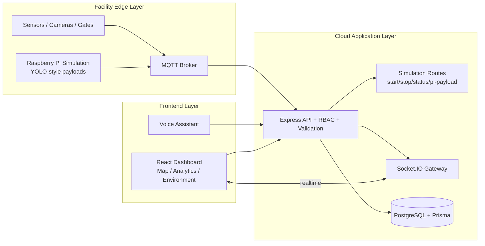
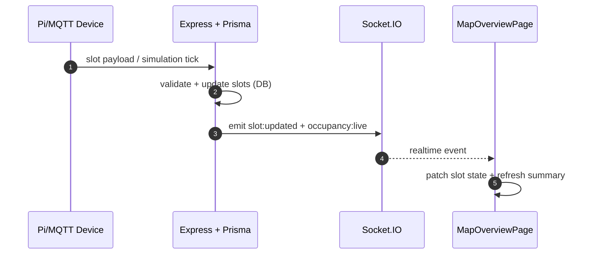

# SmartPark AI

Production-ready hackathon prototype for intelligent urban parking operations with live occupancy, reservations, analytics, voice queries, and Raspberry Pi simulation.

## Live Demo Links

- Frontend: https://smartpark-client.onrender.com
- Backend API: https://smartpark-server.onrender.com
- Repository: https://github.com/goravgumber/SmartPark-AI

## Project Overview

SmartPark AI is a full-stack realtime platform built for smart city parking workflows:

- Live facility map with realtime slot updates
- Reservation lifecycle with atomic slot transitions
- Analytics and environmental impact dashboards
- Voice assistant (Hindi + English) with API-backed responses
- Raspberry Pi payload simulator for realistic demo telemetry

## Features

- Authentication and RBAC (DRIVER, OWNER, ADMIN)
- Realtime event pipeline (MQTT -> Backend -> Socket.IO -> Frontend)
- Reservation conflict protection and transaction-safe updates
- Alerts and device monitoring
- Sectioned architecture for demo today and production scaling tomorrow

## AMD Technology Integration

SmartPark AI is mapped to AMD edge-to-cloud architecture:

- **AMD EPYC**: backend APIs, websocket fan-out, and analytics workloads
- **AMD Ryzen**: edge/facility node for on-site IoT ingestion and buffering
- **AMD Instinct + ROCm**: future inference plane for demand prediction
- **AMD Adaptive SoCs**: device-tier signal processing model

Detailed mapping: [docs/AMD_ARCHITECTURE.md](docs/AMD_ARCHITECTURE.md)

## Architecture Overview

### End-to-End System Flow



### Realtime Slot Update Pipeline



## Raspberry Pi Simulation

Simulation is controlled from the map page panel:

- Start/stop simulation interval (2s / 5s / 10s)
- Randomized slot transitions for selected facility
- Device payload ingestion route for synthetic edge messages
- Live counters (updates, slots changed, uptime)

API routes:

- `GET /api/simulation/status`
- `POST /api/simulation/start`
- `POST /api/simulation/stop`
- `POST /api/simulation/pi-payload`

## Tech Stack

- Backend: Node.js, Express.js, Prisma ORM
- Database: PostgreSQL (Render)
- Frontend: React, Vite, Tailwind CSS
- Realtime: Socket.IO
- IoT Simulation: MQTT (Mosquitto simulation)
- Security: JWT, RBAC, validation, rate limiting
- Deployment: Render (Web Service + Static Site + Managed Postgres)

## Local Setup

### 1. Clone

```bash
git clone https://github.com/goravgumber/SmartPark-AI.git
cd SmartPark-AI
```

### 2. Backend

```bash
cd server
cp .env.example .env
npm install
npx prisma generate
npx prisma db push
npm run db:seed
npm run dev
```

### 3. Frontend

```bash
cd ../client
npm install
npm run dev
```

Set `client/.env` for local frontend if needed:

```env
VITE_API_URL=http://localhost:4000/api
VITE_WS_URL=http://localhost:4000
```

## Deployment (Render)

`render.yaml` provisions:

- `smartpark-db` (PostgreSQL)
- `smartpark-server` (Node web service)
- `smartpark-client` (Static site)

Backend runtime requirements:

- `DATABASE_URL`
- `JWT_SECRET`
- `NODE_ENV=production`
- `FRONTEND_URL=https://smartpark-client.onrender.com`
- `DEVICE_API_KEY`

Frontend runtime requirements:

- `VITE_API_URL=https://smartpark-server.onrender.com/api`
- `VITE_WS_URL=https://smartpark-server.onrender.com`

## Demo Credentials

- Admin: `admin@smartpark.ai` / `Admin@123`
- Owner: `owner@smartpark.ai` / `Admin@123`
- Driver: `driver@smartpark.ai` / `Admin@123`

## Hackathon Judge Flow

1. Login as Admin and open Map Overview.
2. Start Raspberry Pi Simulator from top-right panel.
3. Show live slot color transitions and occupancy summary updates.
4. Create reservation from available slot modal.
5. Open Analytics and Revenue pages to show KPIs and trends.
6. Open Environment dashboard for measurable impact metrics.
7. Trigger Voice Assistant query in Hindi/English.
8. Show AMD architecture docs for scalability narrative.

## Screenshots (Placeholders)

- `docs/screenshots/login.png`
- `docs/screenshots/map-overview.png`
- `docs/screenshots/analytics.png`
- `docs/screenshots/environment.png`
- `docs/screenshots/simulation-panel.png`

## Future Scope

- AI demand forecasting service on AMD Instinct + ROCm
- Dynamic pricing recommendation autopilot with review workflow
- Multi-facility tenancy and regional federation
- Redis-backed distributed websocket scaling and caching
- Observability stack (OpenTelemetry + traces + SLOs)
