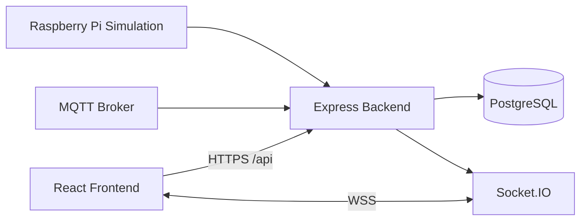
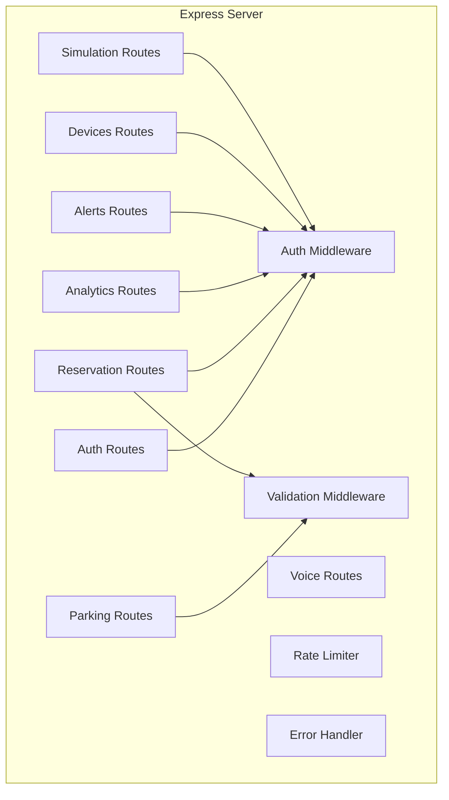
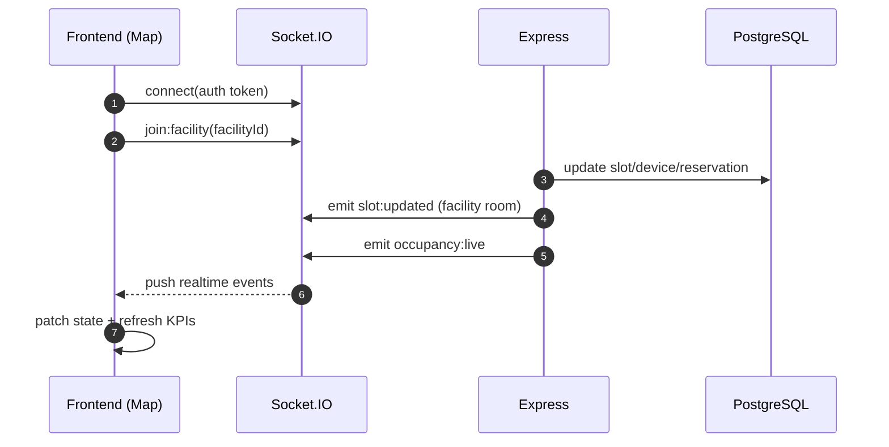
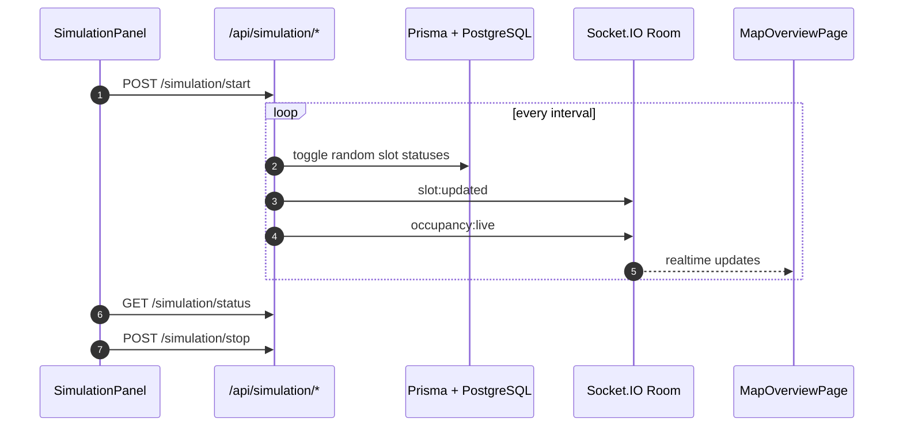
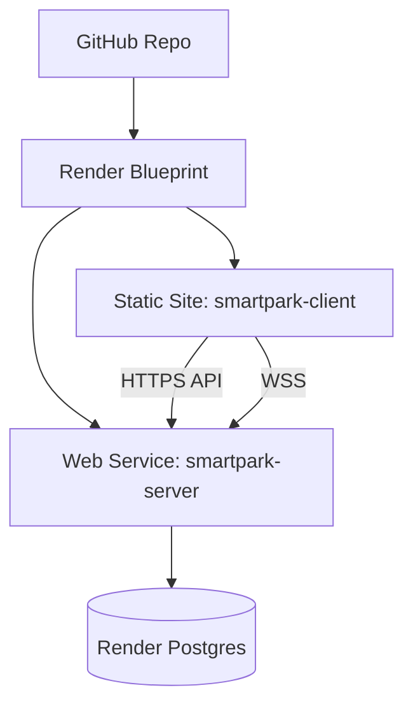

# SmartPark AI — System Architecture

## 1. Architectural Overview

SmartPark AI is a monorepo full-stack system with secure APIs, realtime eventing, and simulated IoT ingestion.

- **Client**: React + Vite dashboard
- **Server**: Express APIs + Socket.IO + validation/RBAC middleware
- **Data**: PostgreSQL via Prisma
- **Realtime**: Socket rooms per facility
- **IoT simulation**: MQTT and REST simulation endpoints

## 2. High-Level Components

## 3. Backend Module Breakdown

## 4. Realtime Flow (WebSocket)

## 5. IoT Simulation Flow

## 6. Reservation + Integrity Model

- Reservation creation checks slot availability and conflicting windows.
- Slot status transitions are persisted in DB before event emission.
- Critical updates run in transactions to reduce double-booking risk.
- Role checks enforce who can check-in/check-out/cancel.

## 7. Security Controls in Current Build

- JWT auth middleware for protected routes
- RBAC for OWNER/ADMIN actions
- Input validation middleware for API payloads
- Rate limiting for abuse reduction
- CORS restricted via `FRONTEND_URL`
- Socket handshake token verification

## 8. Deployment Topology (Render)

## 9. Operational Notes

- Frontend API and websocket URLs are env-driven (`VITE_API_URL`, `VITE_WS_URL`).
- Backend trust proxy and CORS are env-driven for Render.
- Seed script is idempotent and safe for repeat deploys.
